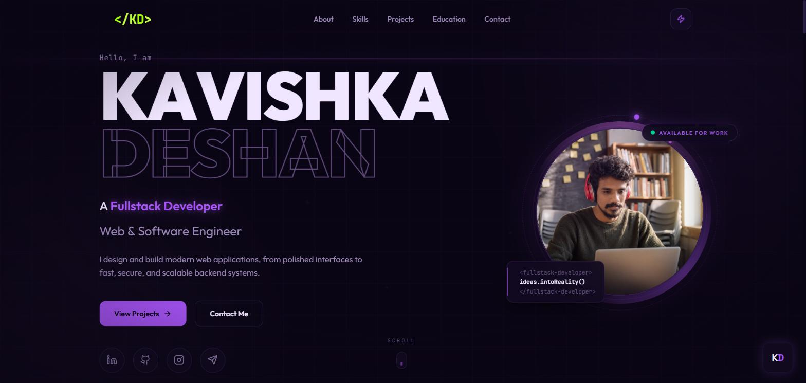
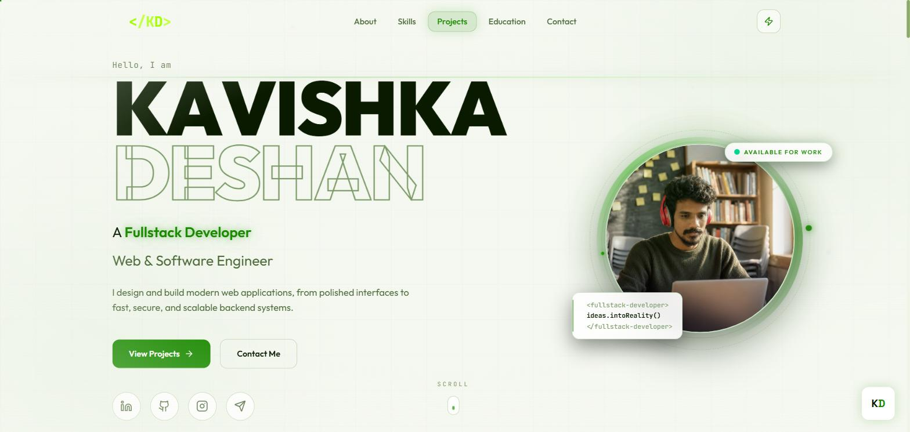
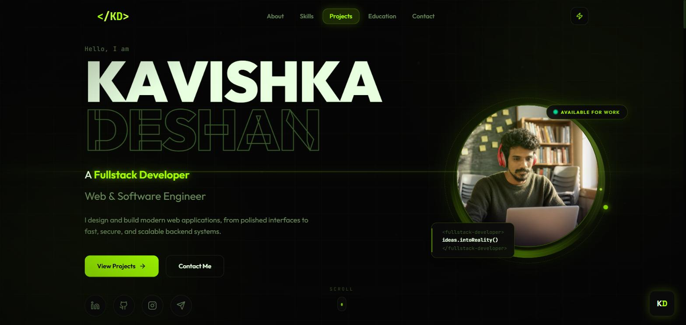
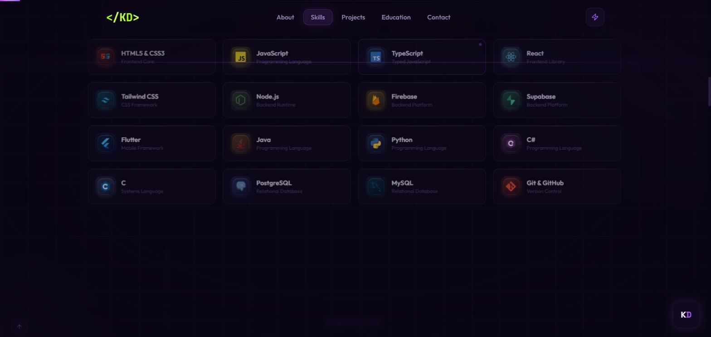
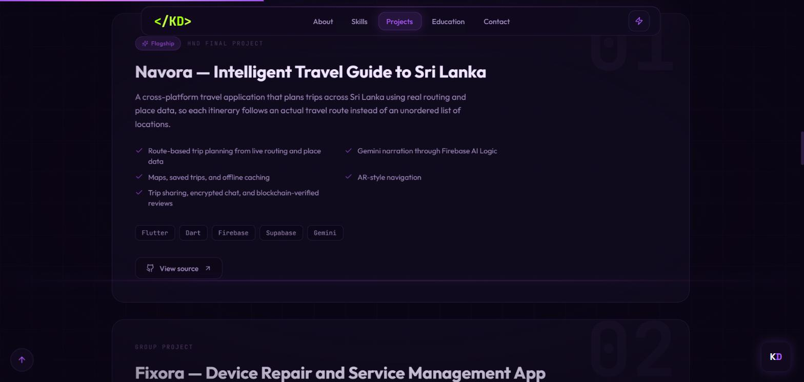

<div align="center">

# `</KD>` &nbsp; Kavishka Deshan — Developer Portfolio

**A fast, animated, fully themeable portfolio built with Next.js 15 and deployed as a static site.**

[](https://kavishkadeshan.dev)
[](https://github.com/Kavishka-Deshan/Portfolio/actions/workflows/deploy.yml)
[](https://nextjs.org)
[](https://www.typescriptlang.org)
[](https://tailwindcss.com)

<a href="https://kavishkadeshan.dev"><strong>→ Visit the live site</strong></a>

<br>



</div>

---

## Overview

A single-page portfolio for a Software Engineering undergraduate, built to be genuinely fast while carrying a
significant amount of motion. Everything is statically exported — there is no server at runtime — and the entire
visual system runs off one set of CSS custom properties, so all three themes recolour from a single source.

| | |
|---|---|
| **Live** | [kavishkadeshan.dev](https://kavishkadeshan.dev) |
| **Hosting** | GitHub Pages, deployed by GitHub Actions on every push to `main` |
| **Rendering** | Static export (`output: "export"`) — no server, no runtime cost |
| **Bundle** | ~40 kB route, ~198 kB first load JS |
| **Pages** | Single page with six sections + a styled 404 |

---

## Three themes, one token set

Every colour, glow, shadow and animation reads from the same CSS custom properties. Switching theme rewrites one
`data-theme` attribute — no component knows which theme is active.

<table>
<tr>
<td width="33%"><p align="center"><strong>Dark</strong><br><sub>violet accent</sub></p></td>
<td width="33%"><p align="center"><strong>Light</strong><br><sub>green accent</sub></p></td>
<td width="33%"><p align="center"><strong>Cyber</strong><br><sub>lime accent</sub></p></td>
</tr>
</table>

The choice persists to `localStorage`, and the colour cross-fade is armed only while the swap is happening — the
rest of the time no element carries a live transition, which keeps hover states crisp.

---

## Sections



**Skills** — 16 technologies, each with its real brand mark drawn as inline SVG, on a glass tile that tilts in 3D on
hover with a specular sweep. Tooltips lift the hovered card above its neighbours so they are never clipped.



**Featured Work** — six projects, each with a cursor-tracked spotlight, a gradient rim on hover, a flagship badge,
and highlight bullets pulled straight from the content file.

Also included: an **About** section whose code panel types itself out line by line with a synthesised keystroke
sound, an **Education** timeline, and a **Contact** form.

---

## Notable implementation details

**Custom cursor** — a comet: a glowing head that tracks the pointer, a ring trailing on a spring, and six tail dots
chasing on progressively softer springs. Entirely DOM + transforms, so it stays on the compositor.

**Entrance sequence** — an orbiting-rings loader with a conic gradient sweeping the monogram tile's border, an
RGB-split glitch, particles converging inward, and `LOADING` resolving out of scrambled glyphs.

**Per-letter name animation** — each glyph of the hero name is its own element. Hovering one flips it 360° on X with a
five-layer extruded shadow, while neighbours ride a cosine falloff so the whole word ripples.

**Synthesised audio** — no audio files ship. Keystrokes are built from a band-passed noise transient plus a low sine
body; the logo chime is a root plus a fifth through a low-pass, with an eased attack so it reads as a note, not a beep.

**Contact form** — posts to the Web3Forms API with client-side validation, an inline error state, a honeypot field,
and toast feedback. The access key is a public submit-only token, safe to ship in a static build.

---

## Tech stack

| Layer | Choice |
|---|---|
| Framework | Next.js 15.5 (App Router) |
| Language | TypeScript 5.9 (strict) |
| Styling | Tailwind CSS 4.1 + CSS custom properties |
| Animation | Framer Motion 12 |
| Icons | Lucide React + hand-drawn brand SVGs |
| Notifications | Sonner |
| Forms | Web3Forms |
| CI/CD | GitHub Actions → GitHub Pages |

---

## Project structure

```
src/
├─ app/
│  ├─ layout.tsx          root layout, fonts, metadata, theme provider
│  ├─ page.tsx            composes every section
│  └─ globals.css         theme tokens for all three themes
├─ components/
│  ├─ sections/           Hero, About, Skills, Projects, Education, Contact, Footer, Navbar
│  ├─ effects/            Cursor, Scanlines, PageLoader, PageTransition, SectionTransition, AnimatedSection
│  └─ ui/                 TiltCard, ThemeToggle, BackToTop, ScrollProgress, FloatingAction, SkillLogos, Toasts
├─ content/
│  └─ portfolio.ts        all copy and project data — edit here, not in components
└─ context/
   └─ ThemeContext.tsx    theme state + persistence
```

All text, projects and links live in **`src/content/portfolio.ts`**. Updating the site's content never means touching
a component.

---

## Running locally

```bash
git clone https://github.com/Kavishka-Deshan/Portfolio.git
cd Portfolio
npm install
npm run dev
```

Open <http://localhost:3000>.

| Script | Does |
|---|---|
| `npm run dev` | Development server with hot reload |
| `npm run build` | Production build + static export to `out/` |
| `npm run lint` | ESLint |
| `npm run typecheck` | `tsc --noEmit` |

### Contact form

The form needs a [Web3Forms](https://web3forms.com) access key. A working key ships as the default; to use your own:

```bash
cp .env.local.example .env.local
# then set NEXT_PUBLIC_WEB3FORMS_KEY
```

---

## Deployment

Pushing to `main` triggers `.github/workflows/deploy.yml`, which typechecks, builds, exports, and publishes to
GitHub Pages. Full DNS and custom-domain steps are in [`docs/DEPLOY.md`](docs/DEPLOY.md).

The custom domain lives in `public/CNAME`. If you change it, keep these in step:

- `public/CNAME`
- `public/robots.txt` — the `Sitemap:` line
- `public/sitemap.xml` — the `<loc>`
- `src/app/layout.tsx` — `metadataBase`

---

## Accessibility & performance

- Respects `prefers-reduced-motion` — animation and smooth scrolling are disabled for users who ask for it
- A single `<h1>`, alt text on every image, and semantic landmarks
- Hero image served at 88 kB; the whole export is ~1.9 MB
- Animation is transform/opacity only, kept off the main thread
- The cursor canvas idles completely when the pointer is still

---

## Contact

**Kavishka Deshan** — Software Engineering undergraduate, NIBM Sri Lanka

[Portfolio](https://kavishkadeshan.dev) · [LinkedIn](https://linkedin.com/in/kavishka-deshan2001) · [GitHub](https://github.com/Kavishka-Deshan) · [deshank962@gmail.com](mailto:deshank962@gmail.com)

<br>

<div align="center"><sub>Designed &amp; built with passion · © 2026 Kavishka Deshan</sub></div>
